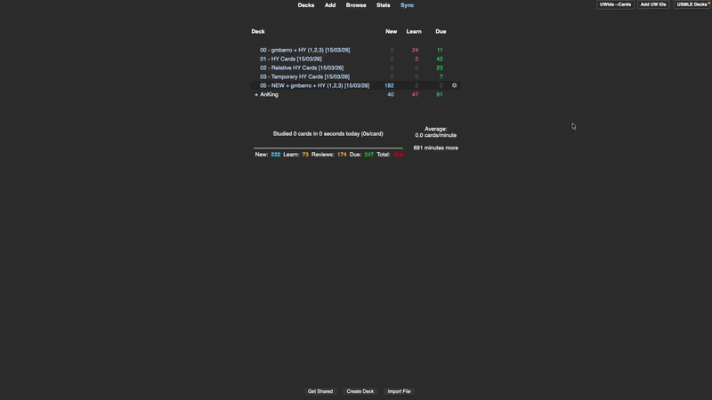

# USMLE Daily Decks

  

Automates daily filtered deck creation for USMLE study using High Yield tags. Eliminates the manual overhead of rebuilding filtered decks each day so you can focus on reviews.

## Features

- Filtered deck creation from HY tags (`1-HighYield`, `2-RelativelyHighYield`, `3-HighYield-temporary`)
- Configurable error tag for cards you got wrong
- New cards deck combining error tag + HY tags
- One-click clear and rebuild
- Optional automatic daily rebuild on Anki startup (respects Anki's rollover hour)

## Deck Structure

| Prefix | Deck Name Pattern | Contents |
|--------|-------------------|----------|
| 00 | [error_tag] + HY (1,2,3) [date] | Due cards with error tag AND any HY tag |
| 01 | HY Cards [date] | Due + learning cards tagged `1-HighYield` |
| 02 | Relative HY Cards [date] | Due + learning cards tagged `2-RelativelyHighYield` |
| 03 | Temporary HY Cards [date] | Due + learning cards tagged `3-HighYield-temporary` |
| 05 | NEW + [error_tag] + HY (1,2,3) [date] | New cards with error tag AND any HY tag |

## Installation

**AnkiWeb:**
Tools → Add-ons → Get Add-ons → paste the addon ID

**Manual:**
Download `.ankiaddon` → Tools → Add-ons → Install from file

## Setup

1. Open **Tools → ⚡ USMLE Decks**
2. Set your error tag (default: `gmberro`)
3. Optionally enable **"Automatic daily rebuild"**
4. Click **"Build Daily Decks"**

## Requirements

- Anki 23.10 or later

## How Auto-Rebuild Works

On Anki startup, the addon compares the current `sched.today` value against the last build day. If different, it silently clears old decks and rebuilds. No dialog is shown—only a brief tooltip notification. Uses Anki's internal day counter, so it respects the configured rollover hour.

## Author & License

Crafted by [drgmb](https://github.com/drgmb)

[MIT License](LICENSE)
